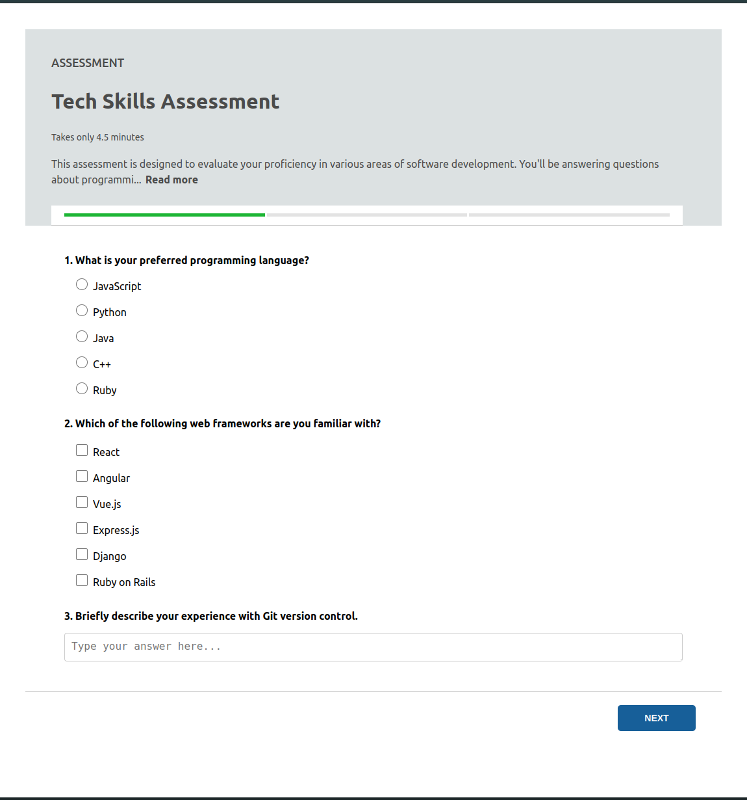
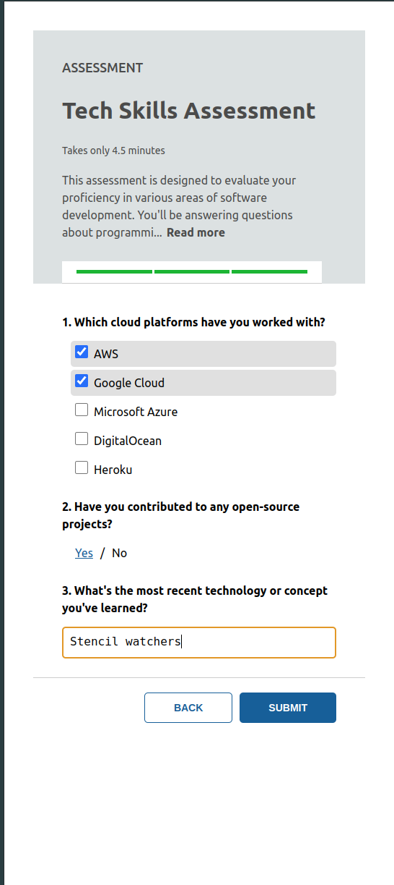
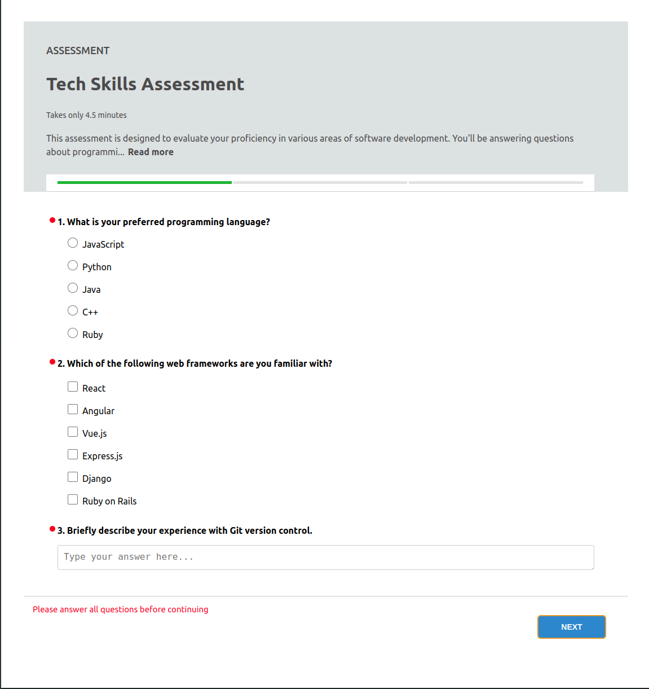
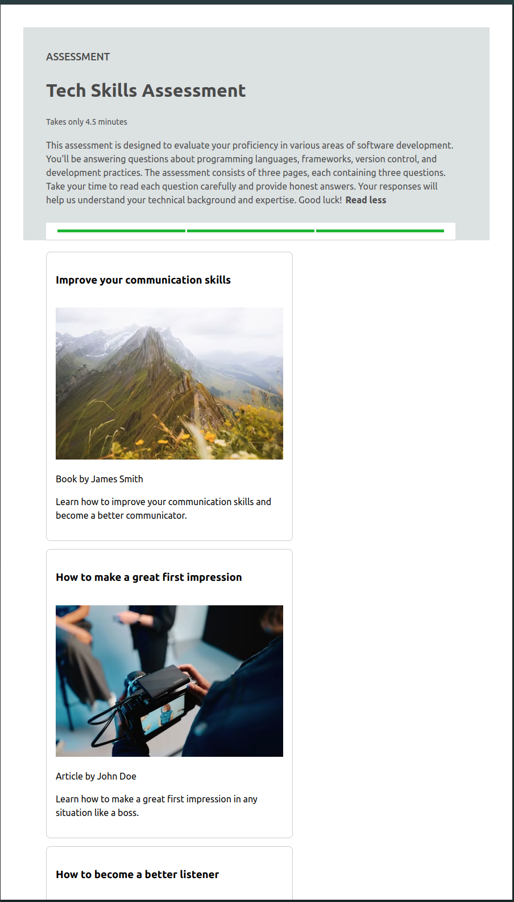

# Survey application built with Stencil and React

### [Project Preview url](https://zc9589-5173.csb.app/)

## References
- [Introduction](#introduction)
- [Getting Started](#getting-started)
  - [Prerequisites](#prerequisites)
  - [Installation](#installation)
  - [Running the Application](#running-the-application)
- [Visual reference of the application](#visual-reference-of-the-application)

## Introduction
This is a survey application built with Stencil and React. <br>
The application is a monorepo setup with two packages: `my-app` and `stencil-library`. <br>
The `my-app` package is a React application that consumes the `stencil-library` package. <br>
The `stencil-library` package is a Stencil web component library that provides the survey components. <br>
You can check the related directories `/packages/my-app` and `/packages/stencil-library` for their respective build process and development. <br>
For full instructions about the monorepo setup, please check the [stencil React integration documentation](https://stenciljs.com/docs/react)

## Getting Started

### Prerequisites

Ensure you have the following installed:

- Node.js (version 14 or higher)
- npm (version 6 or higher)

### Installation

1. Clone the repository:

   ```bash
   git clone https://github.com/mugaber/survey.git
   cd survey
   ```

2. Install the stencil dependencies and build the stencil library:

    ```bash
    cd packages/stencil-library
    npm install
    npm run build
    ```

3. Install the react dependencies:

    ```bash
    cd packages/my-app
    npm install
    ```

### Running the Application

1. Stencil

    ```bash
    cd packages/stencil-library
    npm start
    ```

2. React
    ```bash
    cd packages/my-app
    npm run dev
    ```

## Visual reference of the application
### Main page big screen


### Main page small screen


### Error state


### Recommendations page


### Recommendations page small screen

