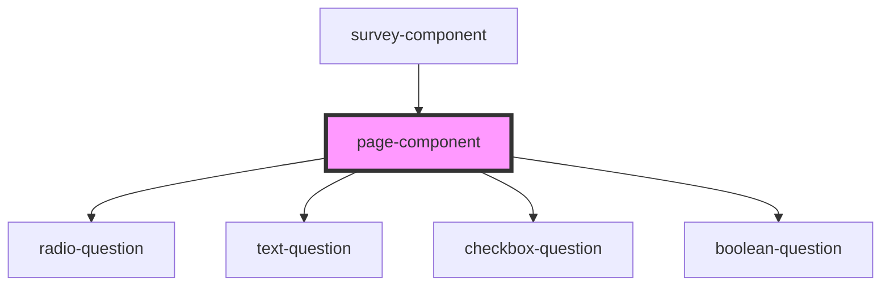

# page-component

<!-- Auto Generated Below -->

## Properties

| Property              | Attribute   | Description | Type                                     | Default     |
| --------------------- | ----------- | ----------- | ---------------------------------------- | ----------- |
| `questions`           | `questions` |             | `any`                                    | `undefined` |
| `unansweredQuestions` | --          |             | `string[]`                               | `undefined` |
| `updateAnswers`       | --          |             | `(key: string, value: string[]) => void` | `undefined` |

## Dependencies

### Used by

 - [survey-component](../survey-component)

### Depends on

- [radio-question](../radio-question)
- [text-question](../text-question)
- [checkbox-question](../checkbox-question)
- [boolean-question](../boolean-question)

### Graph

----------------------------------------------

*Built with [StencilJS](https://stenciljs.com/)*
