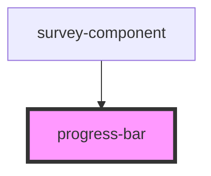

# progress-bar

<!-- Auto Generated Below -->

## Properties

| Property   | Attribute  | Description | Type     | Default     |
| ---------- | ---------- | ----------- | -------- | ----------- |
| `progress` | `progress` |             | `number` | `undefined` |
| `total`    | `total`    |             | `number` | `undefined` |

## Dependencies

### Used by

 - [survey-component](../survey-component)

### Graph

----------------------------------------------

*Built with [StencilJS](https://stenciljs.com/)*
