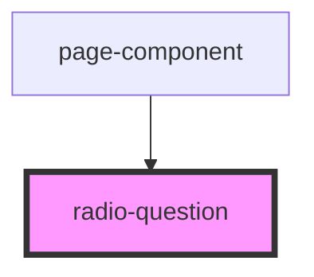

# radio-question

<!-- Auto Generated Below -->

## Properties

| Property         | Attribute         | Description | Type                                                                | Default     |
| ---------------- | ----------------- | ----------- | ------------------------------------------------------------------- | ----------- |
| `question`       | --                |             | `{ name: string; title: string; type: string; choices: string[]; }` | `undefined` |
| `questionNumber` | `question-number` |             | `number`                                                            | `undefined` |
| `updateAnswers`  | --                |             | `(key: string, value: string[]) => void`                            | `undefined` |

## Dependencies

### Used by

 - [page-component](../page-component)

### Graph

----------------------------------------------

*Built with [StencilJS](https://stenciljs.com/)*
