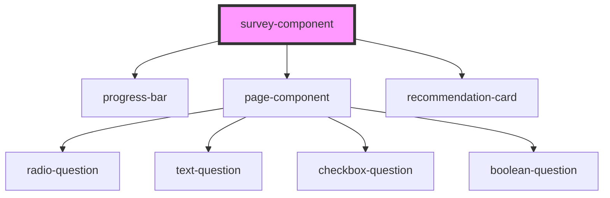

# survey-component

<!-- Auto Generated Below -->

## Properties

| Property     | Attribute     | Description | Type  | Default     |
| ------------ | ------------- | ----------- | ----- | ----------- |
| `surveyData` | `survey-data` |             | `any` | `undefined` |

## Dependencies

### Depends on

- [progress-bar](../progress-bar)
- [page-component](../page-component)
- [recommendation-card](../recommendation-card)

### Graph

----------------------------------------------

*Built with [StencilJS](https://stenciljs.com/)*
